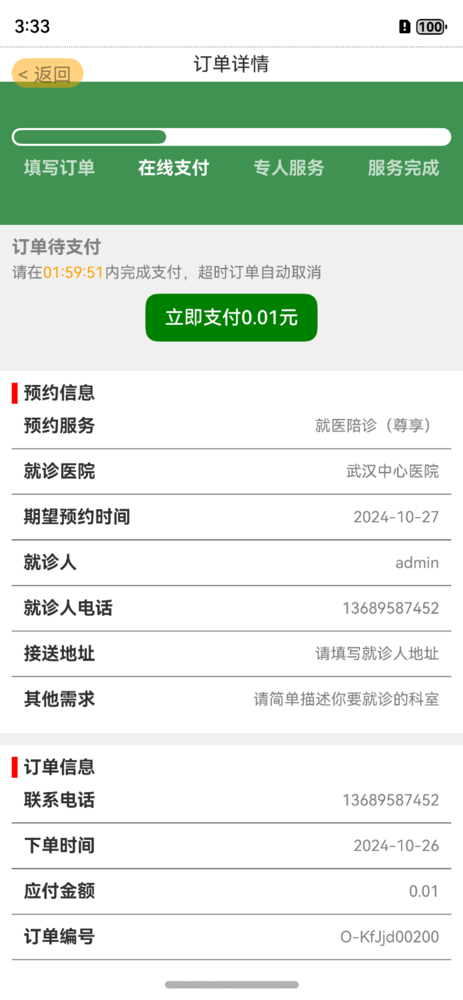
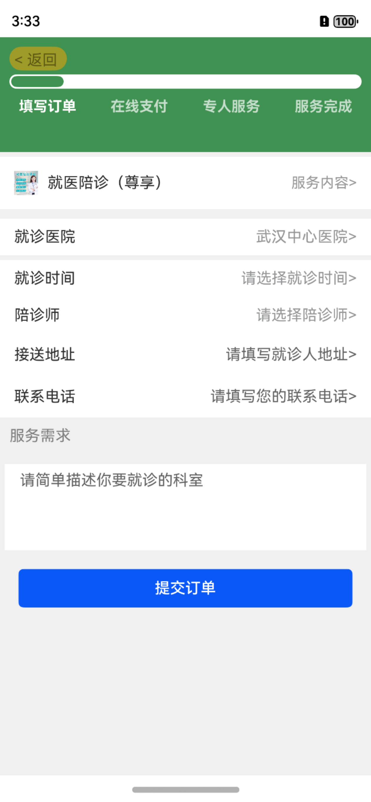
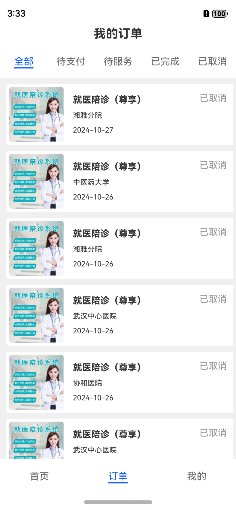
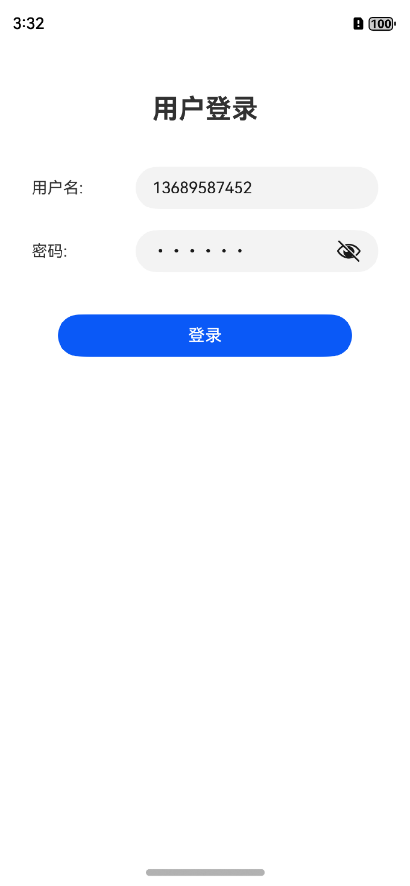
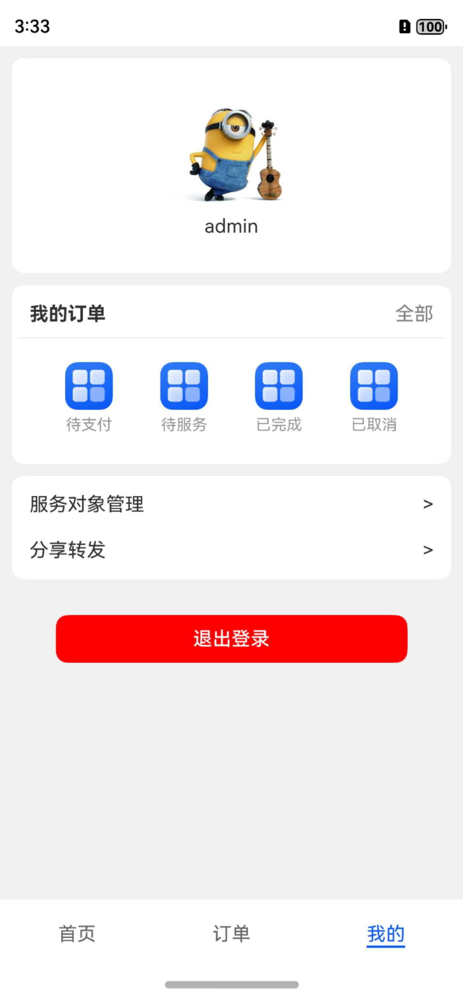
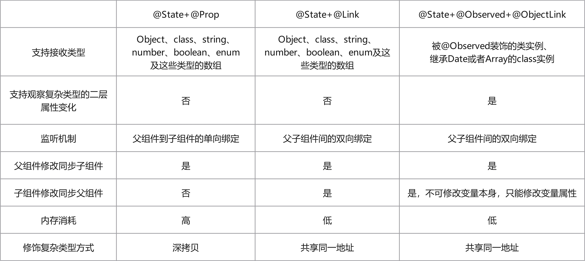
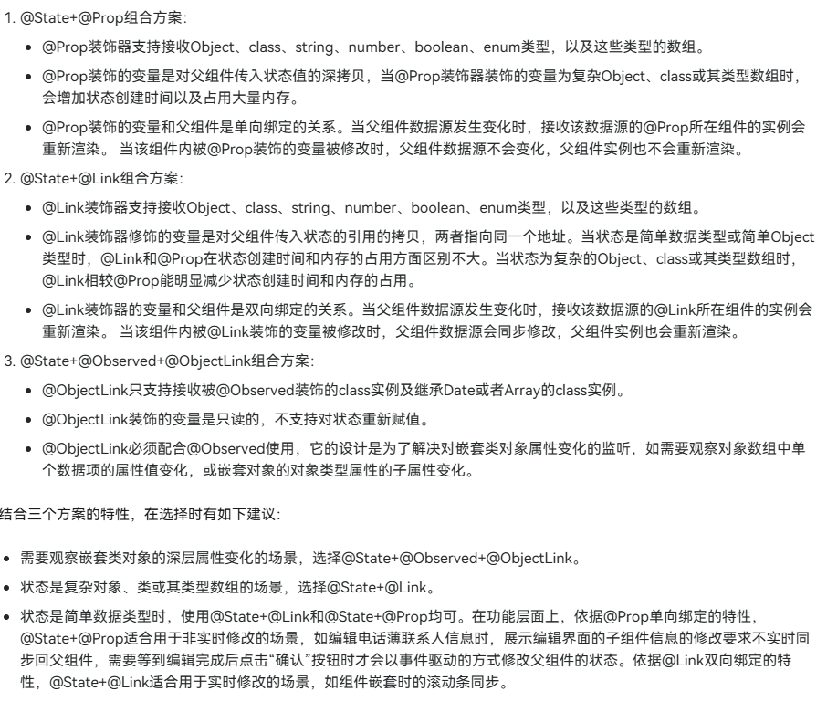
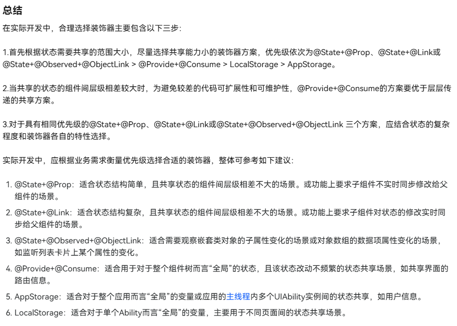
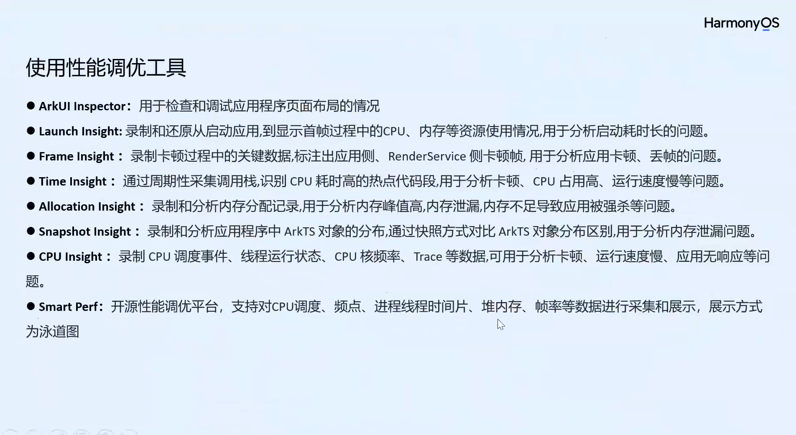

### Harmony next APP 练习项目

| 截图                                               | 截图                                               |
|--------------------------------------------------|--------------------------------------------------|
|  |  |
|  |  |
|  |  |

### NOTES
1. 状态管理组件的解释和使用原则
```text
ArkUI提供了@State+@Prop、@State+@Link、@State+@Observed+@ObjectLink、@Provide+@Consume、AppStorage、LocalStorage六种装饰器组合以解决不同范围内的组件间状态共享。按照共享范围能力从小到大，各装饰器组合的共享范围能力和生命周期如下：

@State+@Prop、@State+@Link、@State+@Observed+@ObjectLink：三者的共享范围为从@State所在的组件开始，到@Prop/@Link/@ObjectLink所在组件的整条路径，路径上所有的中间组件通过@Prop/@Link/@ObjectLink都可以共享同一个状态。@State修饰的状态和其所属的自定义组件共享生命周期，在组件内定义时创建，组件销毁时被回收。@Link装饰的变量和其所属的自定义组件共享生命周期。@ObjectLink装饰的变量和其所属的自定义组件共享生命周期。
@Provide+@Consume：状态共享范围是以@Provide所在组件为祖先节点的整棵子树，子树上的任意后代组件通过@Consume都可以共享同一个状态。@Provide修饰的变量与其所属的组件绑定，在组件内定义时被创建，在组件销毁时被回收。
LocalStorage：共享范围为UIAbility内以页面为单位的不同组件树间的共享。存储在LocalStorage中的状态的生命周期与LocalStorage绑定。LocalStorage的生命周期由应用程序决定，当应用释放最后一个指向LocalStorage的引用时，LocalStorage被垃圾回收。
AppStorage：共享范围是应用全局。AppStorage与应用的进程绑定，由UI框架在应用程序启动时创建，当应用进程终止，AppStorage被回收。

按照软件开发原则，应优先选择共享范围能力小的装饰器方案，减少不同模块间的数据耦合，便于状态及时回收。建议选择装饰器的优先级为：@State+@Prop、@State+@Link、@State+@Observed+@ObjectLink > @Provide+@Consume > LocalStorage > AppStorage。
```
 
 
 

2. 使用自定义事件发布订阅
```typescript
import { ButtonComponent } from '../components/ButtonComponent';
import { ListItemComponent } from '../components/ListItemComponent';

@Entry
@Component
struct UseEmitterPublish {
  listData: string[] = ['A', 'B', 'C', 'D', 'E', 'F'];

  build() {
    Column() {
      Row() {
        Column() {
          ButtonComponent()
        }
      }

      Column() {
        Column() {
          List() {
            ForEach(this.listData, (item: string, index: number) => {
              ListItemComponent({ myItem: item, index: index })
            })
          }
          .height('100%')
            .width('100%')
            .alignListItem(ListItemAlign.Center)
        }
      }
    }
  }
}

///////////////////////////////////
import { emitter } from '@kit.BasicServicesKit';

@Component
export struct ButtonComponent {
  value: number = 2;

  build() {
    Button(`下标是${this.value}的倍数的组件文字变为红色`)
      .onClick(() => {
        let event: emitter.InnerEvent = {
          eventId: 1,
          priority: emitter.EventPriority.LOW
        };
        let eventData: emitter.EventData = {
          data: {
            value: this.value
          }
        };
        // 发送eventId为1的事件，事件内容为eventData
        emitter.emit(event, eventData);
        this.value++;
      })

  }
}

///////////////////////////////////
import { emitter } from '@kit.BasicServicesKit';

@Component
export struct ListItemComponent {
  @State color: Color = Color.Black;
  @Prop index: number;
  @Prop myItem: string;

  aboutToAppear(): void {
    let event: emitter.InnerEvent = {
      eventId: 1
    };
    // 收到eventId为1的事件后执行该回调
    let callback = (eventData: emitter.EventData): void => {
      if (eventData.data?.value !== 0 && this.index % eventData.data?.value === 0) {
        this.color = Color.Red;
      }
    };
    // 订阅eventId为1的事件
    emitter.on(event, callback);
  }

  build() {
    Column() {
      Text(this.myItem)
        .fontSize(50)
        .fontColor(this.color)
    }
  }
}
```
3. 读取rawfile里的配置
> this.context .resourceManager .getRawFileContent(this.songList[this.selectIndex].lyric)
4. 获取 Promise 模式下指定资源路径对应的原始文件资源描述符。
> let rawfileFd = await this.context.resourceManager.getRawFd(songItem.src)
> this.context.resourceManager.closeRawFd(this.songItem.src);
5. 在 Promise 模式下，获取指定资源对象对应的媒体文件内容。
>  this.context.resourceManager.getMediaContent(this.songList[this.selectIndex].label)
6. 性能优化工具
 
7. 组件异步加载特性
```javascript
// syncLoad设置false，或缺省设置，都是异步加载图片
Image('https://example.com/icon.png')
  .syncLoad(false)
```
8. 多线程并发方案(TaskPool和Worker)
